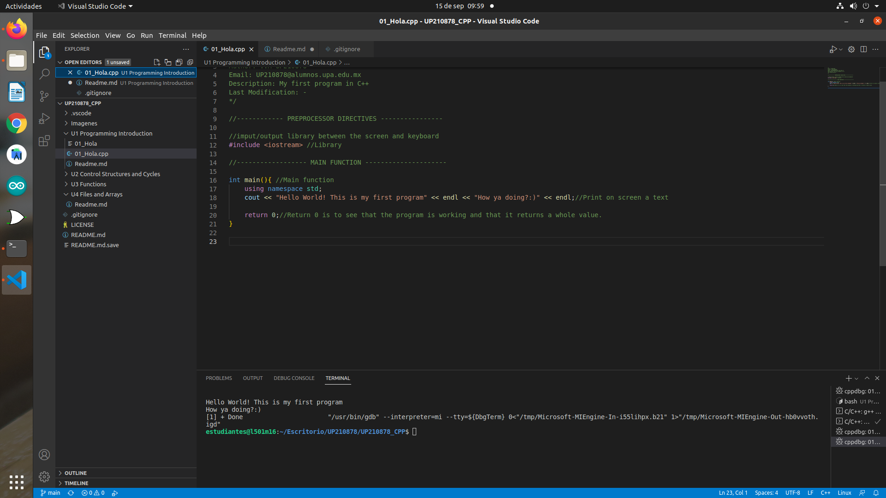
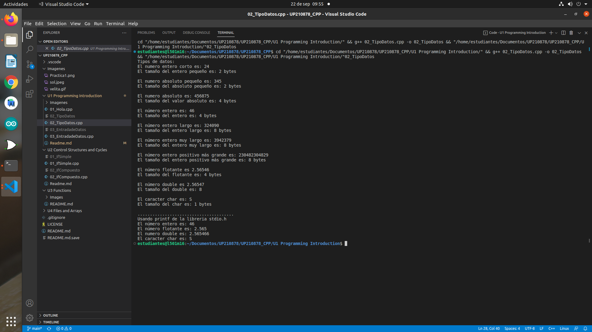
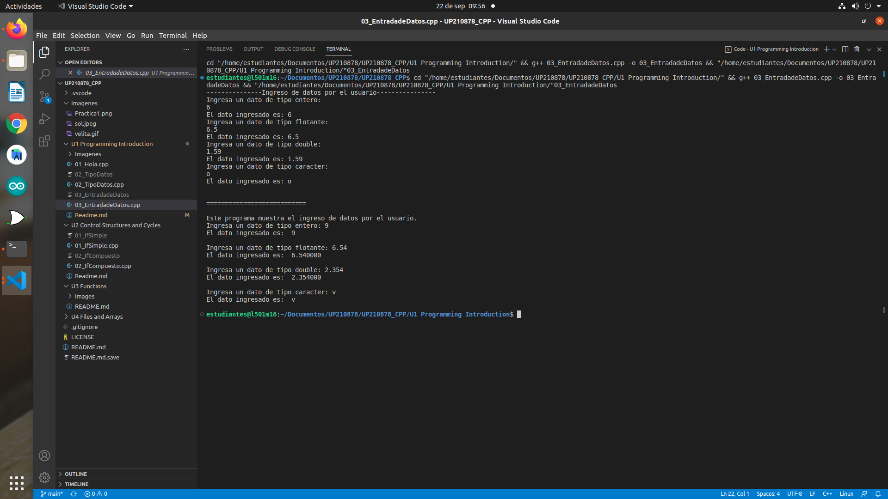

<h1 align="center">
WELCOME TO UNIT 1: PROGRAMMING INTRODUCTION

### This unit is about the basics in programming
In this repository you'll see the first programs I'll make for this class. It mostly encompasses about basic stuff like data sizes, using formats, learning to code properly, setting up preprocessor instructions, making nice readme.md and all sort of stuff.  

## Hope you enjoy  

<h2 align="center">
Practice 1 [Hola]
</h4>

### Preview  

    

### Summary
Test file, basics about programming.
### Explanation
The program just writes a simple sentence
> Step 1: Add libraries(iostream)  
> Step 2: Add namespace std to make the iostream more comfortable to use  
> Step 3: Write a phrase using the std::cout command  
> Step 4: Compile and execute    

<h2 align="center">
Practice 2 [Types of Data]
</h4>

### Preview  

  

### Summary
Checking different byte sizes based on the data type.
### Explanation
This programm visualizes a data value and its size in bytes. For example, a float value has 4 bytes while a char value has 1 byte.
> Step 1: Add libraries(iostream & stdio.h)[Preprocesor directives]  
> Step 2: Add namespace std to make iostream easier to use.  
> Step 3: Establish different types of data at the start of the program. i.e Int, float, double.  
> Step 4: Print different established values and number of size in bytes using function sizeof().
> Step 5: Write variant program that uses stdio.h library commands.
> Step 6: Compile and execute.  

<h2 align="center">
Practice 3 [Data Inputs]
</h4>

### Preview  

  

### Summary
Input file, asks the user to type in a data type; prints out data input. File for testing different values in wrong data to see what happens.  
### Explanation
Input heavy file. The program asks the user to input a different type of value in each ocassion, it then prints out the input to see if it matches the data-type the program asks for. The program repeats itself two times but the second time it uses stdio.h library commands.    
> Step 1: Add libraries(iostream & stdio.h)[Preprocessor Directives]  
> Step 2: Add namespace std to make the iostream easier to use.  
> Step 3: Establish different data types at the start.    
> Step 4: Write an output to the data inputed by the user.  
> Step 5: Add a variant program that uses stdio.h and its different forms for inputting values.  
> Step 6: Compile and execute.
> Step 7: Always assume the user is low IQ; test different nonsensical values  