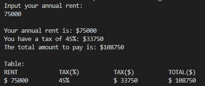
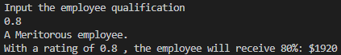

<h1 align="center">
WELCOME TO UNIT 2: CONTROL STRUCTURES AND CYCLES

### This unit is about control structures and cycles.
This unit is about cycles and control structures (i.e: if, if else, for...). During this unit we actually had to make use of our creativity and brain to solve problems (Unlike previous unit which really was just an introduction to programming and using github). Hope you enjoy.
<br /><br />
<div align ="center">

</div> 
<br />

## Index:  

- [Exercise 1](https://github.com/UP210878/UP210878_CPP/tree/main/U2%20Control%20Structures%20and%20Cycles#-exercise-1--annual-rent-program-for-calculating-taxes-for-an-anual-rent-based-on-a-value-the-user-inputs)  
- [Exercise 2](https://github.com/UP210878/UP210878_CPP/tree/main/U2%20Control%20Structures%20and%20Cycles#-exercise-1--annual-rent-program-for-calculating-taxes-for-an-anual-rent-based-on-a-value-the-user-inputs)  
- [Exercise 3](https://github.com/UP210878/UP210878_CPP/tree/main/U2%20Control%20Structures%20and%20Cycles#-exercise-1--annual-rent-program-for-calculating-taxes-for-an-anual-rent-based-on-a-value-the-user-inputs)  
- [Exercise 4](https://github.com/UP210878/UP210878_CPP/tree/main/U2%20Control%20Structures%20and%20Cycles#-exercise-1--annual-rent-program-for-calculating-taxes-for-an-anual-rent-based-on-a-value-the-user-inputs)  
<br />
<h1 align="center">
 Exercise 1.- Annual Rent [Program for calculating taxes for an anual rent based on a value the user inputs]
</h1>

### Input
```c++
    cout << "Input your annual rent:" << endl;  
    cin >> Renta;  
```

### Process
 ``` c++  
    if (Renta > 0 )  
    {  
        if (Renta >= 60000)  
        {  
            Impuesto = Renta*.45;  
        }  
        else if (Renta >= 35000)  
        {  
            Impuesto = Renta*.30;  
        }  
        else if (Renta >= 20000)  
        {  
            Impuesto = Renta*.20;  
        }  
        else if (Renta >= 10000)  
        {  
            Impuesto = Renta*.15;  
        }  
        else if (Renta >= 0)  
        {  
            Impuesto = Renta*.05;  
        } 
```

### Output
```c++
        cout << endl << "Your annual rent is: $" << Renta << endl;//Rent value inputted
        cout << "You have a tax of " << (Impuesto/Renta)*100 << "%: $" << Impuesto << endl; //Print out tax percentage followed by money value
        cout << "The total amount to pay is: $" << Renta + Impuesto << endl << "\nVisualización en tabla:\n"; //Table visualization (Alternative view)
        cout << "RENT      TAX(%)     TAX($)     TOTAL($)"<< endl;
        cout << "$ " << Renta << "      " << (Impuesto/Renta)*100 << "% 
    }
```
### Explanation
This program is about applying a tax to an annual rent based on the rent value:  
RENT VALUE | TAX(%)  
60000 | 45%  
35000 | 30%  
20000 | 20%  
10000 | 15%  
+0    | 5%  
The program works this way:  
1. Ask the user to write their annual rent.
2. The user types in their annual rent.
3. Through the use of _if_ , verify that the user typed in a valid number in the rent.
4. If the user types in a wrong number, don't run the program.
5. If the user types in a valid number proceed with the main _if_ function:  
5.1. Check the data value and run it through a bunch of _if_ and _if else_ in descending order.  
5.2. If the value is bigger than 60000, multiply the tax value by .45 to symbolise that the tax is 45%. If the value is bigger than 35000, apply a tax of 30% by multiplying it by .30 and so on.  
6. Print out the rent the user initially pays, the tax percentage, the tax value and print out the total of rent the user must pay.
7. Use Return 0 to check if the program is running correctly.
### Tests
One for each case:  
a) +60000  
<div align ="center">

</div>  
b) 35000-59999  
<div align ="center">

</div>  
c) 20000-34999  
<div align ="center">

</div>  
d) 10000-1999  
<div align ="center">

</div>  
e) 1-9999  
<div align ="center">

</div>  

<br /><br /><br /><br /><br />
<h1 align="center">
Exercise 2.- Benefits [Program for calculating a bonus based on an employee evaluation]
</h4>

### Input
```c++
    cout << "Input the employee qualification\n";
    cin >> calificacion;
```

### Process
``` c++
    if ((calificacion == 0.0) || (calificacion == 0.4) || (calificacion >= 0.6) && calificacion<=1){//Multiple If conditions, the number must be 0,0.4 or greater than 0.6 and being lower than 1.
        if (calificacion == 0.0){//Print out evaluation level of the employee
            cout << "An Unacceptable employee.";
        }
        else if (calificacion == 0.4){
            cout << "An Acceptable employee.";
        }   
        else if (calificacion >= 0.6){
            cout << "A Meritorous employee.";
        }
```

### Output
```c++
        cout << "\nWith an evaluation of " << calificacion << " , the employee will receive " << (calificacion*100) << "%: $" << (bono*calificacion) << "\n";//Print out percentage and value of the bonus
    } 
    else {
        cout << "\nThe value you inputted is invalid, try again.\n";//In case the number is invalid
    }
```

### Explanation
Employees are rated based on their work perfomance; this program is about giving the employees their deserved bonus based on their performance on different scalings; however, the rating must be 0.0, 0.4 or greater than 0.6, any other value is invalid. The bonus is a percentage equal to their performance where 100% percent is $2400 and 0% is $0.
The program works this way:  
1. Ask the user about their qualification on a scale on 0 to 1 (Where 1 is 100% and 0 is 0%)
2. If the user types a value other than 0, 0.4 or a number bigger than 0.6, the program does not run and it says that the qualification is invalid.
3. If the user types in a valid value, print out what level the employee has followed up by the bonus percentage and value.
4. Return 0 to check that the program is executing correctly.

### Tests
a) Unacceptable

<div align ="center">

</div> 

b) Acceptable

<div align ="center">

</div> 

c) Meritorious

<div align ="center">

</div> 

d) Invalid

<div align ="center">

</div> 

<br /><br /><br /><br /><br />
<h1 align="center">
Exercise 3.- Game center customer price
</h4>

### Input
```c++
    cout << "Customer age: \n";//Ask for the customer age
    cin >> age;
```

### Process
```c++
    if (age >= 0){
        if (age >= 0 && age <4){
            price = 0;
        }
        else if (age >= 4 && age <= 18){
            price = 5;
        }
        else if (age > 18){
            price = 10;
        }
```

### Output
```c++
        cout << "\nCustomer Age: " << age << "\nPrice to pay: $" << price << endl;//Output customer age and price to pay
    }
    else {
        cout << "\nThe age you've inputted is invalid, try again.\n";//In case the age value is invalid
    }
```
### Explanation
The program is about pricing the entrance for the customer at a game center base on their age:  
+0 years | FREE ENTRANCE  
4-18 years | $5  
+18 years | $10  
It works the following way:  
1. Ask the for the customer age
2. Based on the inputted value, declare a value for the price
3. Print out the customer data and price to pay  
3.1. If the user typed in an invalid response, print out a error message.
4. Return 0 to check that the program ran succesfully.  

### Tests

<br /><br /><br /><br /><br />
<h1 align="center">
Exercise 4.- Vegetarian pizza ingredient selection
</h4>

### Input
```c++
    cout << "Welcome customer to Bella Napoli Pizzeria!\nAll our pizzas have mozzarella and tomato\nWould you like a vegetarian pizza? (Y/N)\n";
    cin >> response;
```
### Process
```c++
    if (response == 'Y' || response == 'N' || response == 'y' || response == 'n')//Check if the user typed in a valid response
    {
        if (response == 'Y' || response == 'y')//Vegetarian options
        {
            do
            {
                cout << "Select an ingredient: \n 1. Pepper\n 2. Tofu\n";
                cin >> ingredient;
            } while (ingredient < 1 || ingredient > 2);
        }
        else if (response == 'N' || response == 'n')//Non-vegetarian options
        {
            do
            {
                cout << "Select an ingredient: \n 1. Pepperoni\n 2. Ham\n 3. Salmon\n";
                cin >> ingredient;
            } while (ingredient < 1 || ingredient > 3);
            index = 1;//Locate the ingredient on the "meat section"
        }
```

### Output
```c++
        cout << "Your pizza has the following ingredients:\n Mozarella \n Tomato\n " << extraingredient[ingredient + index] << endl;//Print out all the ingredients and print out the extra ingredient based on the value inputted by the user
    }
    else
    {
        cout << "You've inputted an invalid response, try again\n";
    }
```

### Explanation
The program asks the user if they'd like a vegetarian pizza at Bella Napoli. Every pizza has the same base ingredients: Mozarrela and Tomate, but an extra ingredient based on if its a vegetarian pizza or not. The extra ingredients are the following :  
Tofu and Pepper (Vegetarian), Pepperoni, Ham or Salmon (Non-vegetarian).  
The program works the following way:  
1. Declare a list of extra ingredients.
2. Ask the user if they would like a vegetarian pizza or not.  
2.1. If the user inputs an invalid response, exit the program.
3. If they chose vegetarian, show a list of the possible extra ingredients and let the user input a number to choose.
4. If they chose non-vegetarian, move the declared list of extra ingredients to the "meat section" and let the user input a number to choose the extra ingredient.
5. Print out the selection of extra ingredients with the default ingredients (Mozarrella and Tomato)
6. Return 0 to check that the program ran succesfully.
### Tests