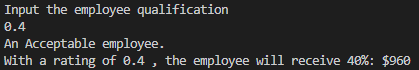
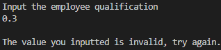

<h1 align="center">
WELCOME TO UNIT 2: CONTROL STRUCTURES AND CYCLES

### This unit is about control structures and cycles.
This unit is about cycles and control structures (i.e: if, if else, for...). During this unit we actually had to make use of our creativity and brain to solve problems (Unlike previous unit which really was just an introduction to programming and using github). Hope you enjoy.

<p align="center">
    


<h1 align="center">
Practice 1.- Renta [Program for calculating taxes for an anual rent based on a value the user inputs]
</h4>

### Input
```c++
    cout << "Input your annual rent:" << endl;  
    cin >> Renta;  
```

### Main Function
 ``` c++  
    if (Renta > 0 )  
    {  
        if (Renta >= 60000)  
        {  
            Impuesto = Renta*.45;  
        }  
        else if (Renta >= 35000)  
        {  
            Impuesto = Renta*.30;  
        }  
        else if (Renta >= 20000)  
        {  
            Impuesto = Renta*.20;  
        }  
        else if (Renta >= 10000)  
        {  
            Impuesto = Renta*.15;  
        }  
        else if (Renta >= 0)  
        {  
            Impuesto = Renta*.05;  
        } 
```

### Output
```c++
        cout << endl << "Your annual rent is: $" << Renta << endl;//Rent value inputted
        cout << "You have a tax of " << (Impuesto/Renta)*100 << "%: $" << Impuesto << endl; //Print out tax percentage followed by money value
        cout << "The total amount to pay is: $" << Renta + Impuesto << endl << "\nVisualización en tabla:\n"; //Table visualization (Alternative view)
        cout << "RENT      TAX(%)     TAX($)     TOTAL($)"<< endl;
        cout << "$ " << Renta << "      " << (Impuesto/Renta)*100 << "% 
    }
```
### Explanation
1. Ask the user to write their annual rent.
2. The user types in their annual rent.
3. Through the use of _if_ , verify that the user typed in a valid number in the rent.
4. If the user types in a wrong number, don't run the program.
5. If the user types in a valid number proceed with the main _if_ function:  
5.1. Check the data value and run it through a bunch of _if_ and _if else_ in descending order.  
5.2. If the value is bigger than 60000, multiply the tax value by .45 to symbolise that the tax is 45%. If the value is bigger than 35000, apply a tax of 30% by multiplying it by .30 and so on.  
6. Print out the rent the user initially pays, the tax percentage, the tax value and print out the total of rent the user must pay.
7. Use Return 0 to check if the program is running correctly.
### Tests
One for each case:  
a) +60000  
<div align ="center">

</div>  
b) 35000-59999  
<div align ="center">

</div>  
c) 20000-34999  
<div align ="center">

</div>  
d) 10000-1999  
<div align ="center">

</div>  
e) 1-9999  
<div align ="center">

</div>  
  
<h1 align="center">
Practice 2.- Benefits [Program for calculating a bonus based on an employee evaluation]
</h4>

### Input
```c++
    cout << "Input the employee qualification\n";
    cin >> calificacion;
```

### Main Function
``` c++
    if ((calificacion == 0.0) || (calificacion == 0.4) || (calificacion >= 0.6) && calificacion<=1){//Multiple If conditions, the number must be 0,0.4 or greater than 0.6 and being lower than 1.
        if (calificacion == 0.0){//Print out evaluation level of the employee
            cout << "An Unacceptable employee.";
        }
        else if (calificacion == 0.4){
            cout << "An Acceptable employee.";
        }   
        else if (calificacion >= 0.6){
            cout << "A Meritorous employee.";
        }
```

### Output
```c++
        cout << "\nWith an evaluation of " << calificacion << " , the employee will receive " << (calificacion*100) << "%: $" << (bono*calificacion) << "\n";//Print out percentage and value of the bonus
    } 
    else {
        cout << "\nThe value you inputted is invalid, try again.\n";//In case the number is invalid
    }
```

### Explanation
1. Ask the user about their qualification on a scale on 0 to 1 (Where 1 is 100% and 0 is 0%)
2. If the user types a value other than 0, 0.4 or a number bigger than 0.6, the program does not run and it says that the qualification is invalid.
3. If the user types in a valid value, print out what level the employee has followed up by the bonus percentage and value.
4. Return 0 to check that the program is executing correctly.

### Tests
a) Unacceptable

<div align ="center">

</div> 

b) Acceptable

<div align ="center">

</div> 

c) Meritorious

<div align ="center">

</div> 

d) Invalid

<div align ="center">

</div> 

<h1 align="center">
Practice 3.- Game center prices by age
</h4>