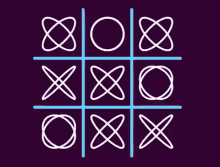
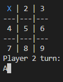
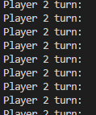
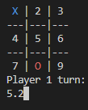
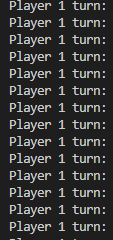

 

<h1 align="center">

 <h2 style="color:#FFD700"> TIC TAC TOE 

 
</h1>

 
<h2 align="center">
</h2>

<h2 align="left">

 <b style="color:#888FFF"> INDEX 
 
</h2></b> 

<h3 style="font-family:Arial;"><b>

[1- CODE TIC TAC TOE (LINUX)](./TicTacToe_Linux.cpp)  

[2- CODE TIC TAC TOE (WINDOWS)](./TicTacToe.cpp)  || [DOWNLOAD EXE (WINDOWS)](./TicTacToe.exe)

[3- How to run]()  

[4- Things to consider]()  

[5- Flowchart]()  

[6- Code development & explanation]()  

[7- Closure]()  

</h3></b>     

    
<h2 align="center">

 <b style="color:#0AAFFF"><i> HOW TO RUN 
 
</h2></b> </i>

There are two game modes, **VS** which is the classic player vs player experience or **Singleplayer** which involves an A.I to act as the other player. When starting the game you select the gamemode, **1** for _VS_ or **2** for _Singleplayer_.  
Select your play on the board using number 1-9.

<h3 align="left">

 <b style="color:#FF0"> LINUX 
 
</h3></b> 

1. Download or clone the directory in github. (Using the command <q><i>git clone https://github.com/UP210878/UP210878_CPP.git</q></i>)  
2. Make sure you already have a compiler. More info: https://www.cyberciti.biz/faq/howto-compile-and-run-c-cplusplus-code-in-linux/  
3. Through the terminal, enter the directory where you cloned the repository using the cd command. (E.g: cd C:\Users\\(Username)\Desktop\UP210878_CPP\U3 Functions)  
4. While in the directory of the repository in <i>U3 Functions</i>, type: ./TicTacToe.  
5. Enjoy.   

<h3 align="left">

 <b style="color:#0A9"> WINDOWS 
 
</h3></b> 

1. Download the [Executable](./TicTacToe.exe)  
2. Run & Enjoy :) .  

OR  

1. Download the [Source code](./TicTacToe.cpp).  
2. Make sure you have a compiler available. I recommend [MinGW](https://sourceforge.net/projects/mingw/).  
3. Load the code in a source editor such as [VS Studio](https://code.visualstudio.com/).  
4. Compile it.  
5. Run & Enjoy :) .  

       

<h2 align="center">

 <b style="color:#F07777"><i> THINGS TO CONSIDER 
 
</h2></b> </i>

* **VS MODE:** You can't select what symbol you are playing; the game assumes that player 1 is <b style="color:#0AAFFF"> X </b> while player 2 is <b style="color:#FF0000"> O </b> 
* **SINGLEPLAYER**: Likewise, you'll play as <b style="color:#0AAFFF"> X </b> while the CPU will be <b style="color:#FF0000"> O </b>.
* **SINGLEPLAYER**: The player <b> ALWAYS </b> goes first, the CPU goes after.

<h3 align="center">

 <b style="color:#F07777"><i> Possible errors 
 
</h3></b></i>

<b>First and foremost, this tic-tac-toe is not perfect in any way shape or form.</b> Its very possible that the program may not run as expected sometimes and that may be due to a missinput, a compiling mistake or another error I've yet to figure out. I'm aiming to make this better but there are some time restrains due to college that may hinder the development of this, but I do intend on coming back to make some adjustments.  That being said, there are some common mistakes one can make when playing with this that may lead to the program to crash, these mistakes include but are not limited to:
<b>

1. Introducing a character instead of a number    

 

2. Introducing a non-integer value  

 

</b> 
I'm still trying to solve these issues but in the meantime I kindly ask for you (the user) to avoid these mistakes. Thank you :D.
     

<h2 align="center">

 <b style="color:#399999"><i> FLOWCHART 
 
</h2></b> </i>

     

<h2 align="center">

 <b style="color:#FF6"><i> CODE DEVELOPMENT & EXPLANATION 
 
</h2></b> </i>

     

<h2 align="center">

 <b style="color:#BFFF"><i> CLOSURE 
 
</h2></b> </i>
