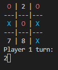

<h1 align="center">

 <h2 style="color:#FFD700"> TIC TAC TOE 

 
</h1>

 
<h2 align="center">
</h2>

<h2 align="left">

 <b style="color:#888FFF"> INDEX 
 
</h2></b> 

<h3 style="font-family:Arial;"><b>

[1- CODE TIC TAC TOE (LINUX)](./TicTacToe_Linux.cpp)  

[2- CODE TIC TAC TOE (WINDOWS)](./TicTacToe.cpp)  || [DOWNLOAD EXE (WINDOWS)](./TicTacToe.exe)

[3- How to run](https://github.com/UP210878/UP210878_CPP/tree/main/U3%20Functions#--how-to-run--)  

[4- Things to consider](https://github.com/UP210878/UP210878_CPP/tree/main/U3%20Functions#--things-to-consider--)  

[5- Flowchart](https://github.com/UP210878/UP210878_CPP/tree/main/U3%20Functions#--flowchart--)  

[6- Code execution & explanation](https://github.com/UP210878/UP210878_CPP/tree/main/U3%20Functions#--code-execution--explanation--)  

[7- Closure](https://github.com/UP210878/UP210878_CPP/tree/main/U3%20Functions#--closure--)  

</h3></b>     
    
<h2 align="center">

 <b style="color:#0AAFFF"><i> HOW TO RUN 
 
</h2></b> </i>

There are two game modes, **VS** which is the classic player vs player experience or **Singleplayer** which involves an A.I to act as the other player. When starting the game you select the gamemode, **1** for _VS_ or **2** for _Singleplayer_.  
Select your play on the board using number 1-9.

<h3 align="left">

 <b style="color:#FF0"> LINUX 
 
</h3></b> 

1. Download or clone the directory in github. (Using the command <q><i>git clone https://github.com/UP210878/UP210878_CPP.git</q></i>)  
   
2. Make sure you already have a compiler. More info: https://www.cyberciti.biz/faq/howto-compile-and-run-c-cplusplus-code-in-linux/  
   
3. Through the terminal, enter the directory where you cloned the repository using the cd command. (E.g: cd C:\Users\\(Username)\Desktop\UP210878_CPP\U3 Functions)  
   
4. While in the directory of the repository in <i>U3 Functions</i>, type: cd "/home/(USER)/UP210878_CPP/U3 Functions/" && g++ TicTacToe_Linux.cpp -o TicTacToe_Linux && "/home/estudiantes/Documentos/UP210878/UP210878_CPP/U3 Functions/"TicTacToe_Linux  
   
5. Enjoy :D.   

<h3 align="left">

 <b style="color:#0A9"> WINDOWS 
 
</h3></b> 

1. Download the [Executable](./TicTacToe.exe)  
2. Run & Enjoy :) .  

OR  

1. Download the [Source code](./TicTacToe.cpp).  
2. Make sure you have a compiler available. I recommend [MinGW](https://sourceforge.net/projects/mingw/).  
3. Load the code in a source editor such as [VS Studio](https://code.visualstudio.com/).  
4. Compile it.  
5. Run & Enjoy :) .  

       

<h3> 

[Return to index](https://github.com/UP210878/UP210878_CPP/tree/main/U3%20Functions#--index--)

</h3> 

<h2 align="center">

 <b style="color:#F07777"><i> THINGS TO CONSIDER 
 
</h2></b> </i>

* **VS MODE:** You can't select what symbol you are playing; the game assumes that player 1 is <b style="color:#0AAFFF"> X </b> while player 2 is <b style="color:#FF0000"> O </b> 
* **SINGLEPLAYER**: Likewise, you'll play as <b style="color:#0AAFFF"> X </b> while the CPU will be <b style="color:#FF0000"> O </b>.
* **SINGLEPLAYER**: The player <b> ALWAYS </b> goes first, the CPU goes after.

<h3 align="center">

 Possible Errors.
 
</h3></b></i>

<b>First and foremost, this tic-tac-toe is not perfect in any way shape or form.</b> Its very possible that the program may not run as expected sometimes and that may be due to a missinput, a compiling mistake or another error I've yet to figure out. I'm aiming to make this better but there are some time restrains due to college and personal issues that may hinder the further development of this, but I do intend on coming back to make some adjustments.  That being said, there are some common mistakes one can make when playing with this that may lead to the program to crash, these mistakes include but are not limited to:
<b>

1. Introducing a character instead of a number    

 

2. Introducing a non-integer value  

 

</b> 
I'm still trying to solve these issues but in the meantime I kindly ask for you (the user) to avoid these mistakes. Thank you :D.
     

<h3> 

[Return to index](https://github.com/UP210878/UP210878_CPP/tree/main/U3%20Functions#--index--)

</h3> 

<h2 align="center">

 <b style="color:#399999"><i> FLOWCHART 
 
</h2></b></i>

 

Made with draw.io/diagram.net. [Check them out!](https://github.com/jgraph/drawio-desktop) [Here's their website too!](https://www.diagrams.net/)
     

<h3> 

[Return to index](https://github.com/UP210878/UP210878_CPP/tree/main/U3%20Functions#--index--)

</h3> 

<h2 align="center">

 <b style="color:#FF6"><i> CODE EXECUTION & EXPLANATION 
 
</h2></b></i>
<h3 align="left">

 <b style="color:#0A9"> VS MODE 
 
</h3></b>
Since the Player vs Player mode is pretty straightforward due to both inputs being made by people, I'll use it to cover the basic functioning of the game. (I'm also using the executable version[Windows] to visualize how it looks)   

GAME STARTING MENU.  
You  have the option to choose between gamemode 1 or 2.  
If you choose another value other than 1 or 2, the game exits automatically.
  

  

 

Upon starting a valid gamemode, the game will ask for the first play to make, make a play by introducing the number of the box in the grid you want to ocupy. 

 
  

After introducing the position which you want to mark, the program clears previous plays, prints out a new grid with the indicated mark and starts asking for the move to player 1 and 2 subsequently until there is a winner.  

 
  

If you try to input a play that has already been made the program will ask you again to make a valid play. 

 
  

 If you try to input a play outside the grid, the program will ask you again to make a valid play.

 
  

<h3>Here's how the winner is visualized</h3>

 

    

  
<h3 align="left">

 <b style="color:#0A9"> SINGLEPLAYER/VS CPU/VS A.I.  
 
</h3></b>
Logical reasoning behind the A.I decisions. This time using VS Studio code to simulate running it on Linux.  

Once again, the first thing we do is input 2 in the menu so that it takes us to the Singleplayer mode. Afterwars we must input out first move.

 
  

 

The moment we input our move, the A.I analyzes each posible play in a secondary "invisible" grid that would make it win or prevent the player from winning alternating between using 'O' and 'X' respectively. Since the A.I doesn't have a winning move and we aren't about to win, it just chooses a randon non-ocuppied box in the grid. In this case, it chose 1. 

 
  

After we input our next move, in this case **6**, the computer once again analyzes the whole grid looking for each possible play that might make it win. Since there's no winning play for _'O'_, it checks afterwards for winning plays for _'X'_. The A.I then discovers that position **5** might make the player win next round so it decides to mark that space in the grid.

 
  

Because our brain is so massive we know that **9** would grant the A.I a victory so we proceed to block it and create an opening so that with **3** we may win next round. The A.I once again analyzes the entire grid looking for a play that may make it win. It succeeds but since the box is already marked, it searches for alternative options for winning. It fails and then searches for plays that may make the player win and in doing so it discovers that **3** would make the player win, so it decides to block it. 

 
  

 

Afterwars we decide to put our mark at **2** in an attempt to trick the machine. Unfortunately, the A.I analyzes the board in search for winning plays and finds out that **7** is a viable play for it to win the round so it proceeds to mark that box and end the match.

 
  

  

This doesn't mean the A.I is invincible. Since its first play is random, it's just a matter of luck and thinking to outsmart it so that we can end the match in a draw or even win.

 &emsp; 
 
  

<h3> 

[Return to index](https://github.com/UP210878/UP210878_CPP/tree/main/U3%20Functions#--index--)

</h3> 

     

<h2 align="center">

 <b style="color:#BFFF"><i> CLOSURE 
 
</h2></b></i> 

This project was a lot of fun to make; until we introduced the A.I. It was hard for me to grasp the reasoning behind the A.I decisions and it was more difficult figuring out how to make the A.I "think" by analizing the whole board. At first I was developing a macro rather than an A.I because what it did initially was play based on the user inputs but without analyzing or "thinking" before doing so. Basically, I was programming a set of instrucions based on the play inputs rather than an Artificial Intelligence. However with the help of my peers and some research I was finally able to figure out how to make it "think".    

The code is also really messy and could've used some more refining to make it more readable; The biggest issue by far was overloading the main function, I should've made more functions that replaced some of the things I did in the main function because while reading it I feel like the code repeats itself a lot.    

All problems aside, I consider I did the task succesfully and the program (for the most part) runs smoothly and does what it's supposed to do so I'd consider I was somewhat succesful in my program.    

I also learned that github readme markdown file does not allow some kinds of styles, not CSS nor HTML work for coloring text which is a shame because I like colors :disappointed: (Still allows for emojis though) . Fun fact, If you preview this Readme.md through VS Studio or the like, the markdown will read just fine, with color styles and everything.
          

<h3> 

[Return to index](https://github.com/UP210878/UP210878_CPP/tree/main/U3%20Functions#--index--)

</h3> 